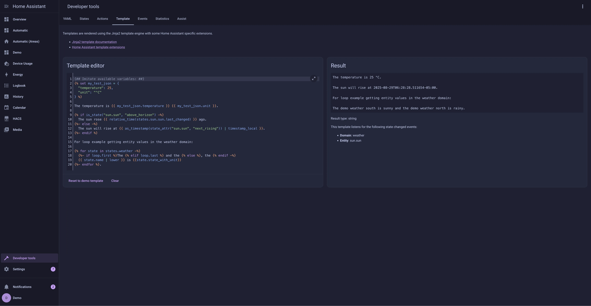

<h3 align="center">
	<br/>
	
	Catppuccin for <a href="https://www.home-assistant.io/">Home Assistant</a>
	
</h3>

<p align="center">
	<a href="https://github.com/catppuccin/home-assistant/stargazers"></a>
	<a href="https://github.com/catppuccin/home-assistant/issues"></a>
	<a href="https://github.com/catppuccin/home-assistant/contributors"></a>
</p>

<p align="center">
	
</p>

## Previews

<details>
<summary>🌻 Latte</summary>


</details>
<details>
<summary>🪴 Frappé</summary>


</details>
<details>
<summary>🌺 Macchiato</summary>




</details>
</details>
<details>
<summary>🌿 Mocha</summary>


</details>

## Usage

### With [HACS](https://hacs.xyz/)

> [!NOTE]
> This will install the default mauve theme shown in the example screenshots. If you wish to have a different highlight color you will need to follow the [manual installation steps](#manual) below.

1. Add the following code to your `configuration.yaml` file (reboot required).

```yaml
frontend:
  ... # your configuration.
  themes: !include_dir_merge_named themes
  ... # your configuration.
```

2. Go to the Community Store.
3. Search for `Catppuccin`.
4. Navigate to `Catppuccin` theme.
5. Press `Install`.
6. Go to Developer Tools, and next Actions. Then select and manually trigger the `frontend.reload_actions` action.
7. Go to the [Profile General tab](https://my.home-assistant.io/redirect/profile) and change Theme under Browser Settings to your desired theme.

### Manual

1. Add the following code to your `configuration.yaml` file (reboot required).

```yaml
frontend:
  ... # your configuration.
  themes: !include_dir_merge_named themes
  ... # your configuration.
```

2. Go to the [latest GitHub release](https://github.com/catppuccin/home-assistant/releases/latest)
   - If you want to install the default (mauve) theme, download the `catppuccin.yaml` file
   - If you want a different highlight color, download and extract the `catppuccin-accents.zip` file and select the accent(s) you want available
3. Move the selected file(s) to the `themes` folder in your [HA configuration directory](https://www.home-assistant.io/docs/configuration/#to-find-the-configuration-directory). (E.g. `~/config/themes`)
4. Run the `frontend.reload_themes` action or restart Home Assistant.
5. Go to the [Profile General tab](https://my.home-assistant.io/redirect/profile) and change Theme under Browser Settings to your desired theme.

## 💝 Thanks to

- [fapfaff](https://github.com/fapfaff)

&nbsp;

<p align="center">
	
</p>

<p align="center">
	Copyright &copy; 2021-present <a href="https://github.com/catppuccin" target="_blank">Catppuccin Org</a>
</p>

<p align="center">
	<a href="https://github.com/catppuccin/catppuccin/blob/main/LICENSE"></a>
</p>
